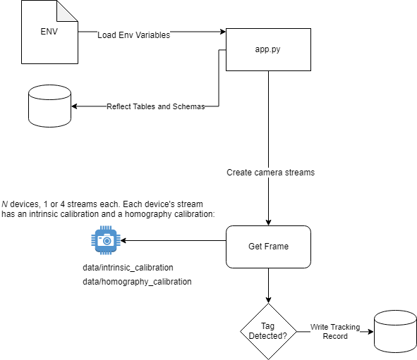

This application was designed to use OpenCV computer vision technology to detect the position of Aruco tags in real world coordinates across multiple cameras without the need for depth-sensing cameras. The Aruco tags were affixed to product baskets to uniquely identify the baskets as they moved throughout this holding storage space. The Arucu-tagged baskets were dated and tracked, all movements syncing back to a database table. The design was intended to assist in managing inventory. 

The deployment consisted of a nine cameras of different types from the makers Bosch and Axis. Most were 4k cameras with a single stream. Others were cameras with four lenses that could be positioned independently. 

Each camera was positioned in a non-symmetrical space and distributed so that all areas of the room were covered. By calculating each camera's intrinsic matrix and homography matrix, the system is able to convert pixel coordinates of a detected Aruco tag to real-world (X,Y) coordinate pairs, even when some cameras were tilted at an angle to the ground.

To learn more about the calibration process, please see the calibration [README](app/data/README.md)