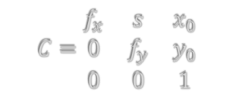

# Intro
Capturing the homography matrix is the most time-consuming process in the entire deployment. It required the positioning of four Aruco tags in the four corners of a camera's field of view. We would then measure the relative real-world position of each corner of each Aruco tag upon its placement. Then, we would run an application to correlate these manually gathered data points to the pixel coordinates of each corner of each Aruco tag to generate the homography matrix. Code for this process can be found [here](https://github.com/txross1993/camera-intrinsic-calibration).

A Camera Matrix and the output of a complete calibration process involves determining a camera's intrinsic parameters and its extrinsic parameters. 

##Intrinsic Matrix
The internal parameters of the camera; your camera’s configuration. Intrinsic parameters are independent of the camera’s positioning.

<br clear=all>



Where:
* 𝑓_𝑥 = horizontal focal length (measured in pixels)
* 𝑓_𝑦 = vertical focal length (measured in pixels)
* 𝑠 = skew, normally assumed to be 0 for digital cameras
* 𝑥_0,𝑦_0= camera coordinates of the center of the camera’s frame, also called the principal point

<br clear=all>

Programmatically calibrating a camera's intrinsic matrix its distortion coefficients is a well documented and physically involved process. You can read the details of this programmatic evaluation [here](https://docs.opencv.org/2.4/modules/calib3d/doc/camera_calibration_and_3d_reconstruction.html). The purpose of this wiki page is to detail the process of capturing valid calibration photos using the [camera-calibration app] (https://github.com/txross1993/camera-intrinsic-calibration).

Please read the README before using this app, as it explains how to use it.

<br clear=all>

##Extrinsic Matrix
The extrinsic matrix represents the camera's position relative to the world. This includes the rotation of the camera's axes in relation to the world as well as its translation from the world origin, as depicted in the image below. [This article](http://ksimek.github.io/2012/08/22/extrinsic/) explains the rotation and translation portions of the extrinsic parameters in depth and provides a good reference point.

<br clear=all>
In general, the extrinsic matrix will take the following form:

Where:
* 𝑟_𝑛 = rotation 
  * [See Basic Rotations on this Wiki page](https://en.wikipedia.org/wiki/Rotation_matrix)
* 𝑡_𝑛 = transformation/translation along the world coordinate system
  * 𝑡_1 == 𝑡_𝑥 - the translation of the camera's x-axis from the world's x-axis.
  * 𝑡_2 == 𝑡_𝑦 - the translation of the camera's y-axis from the world's y-axis.
  * 𝑡_3 == 𝑡_𝑧 - the translation of the camera's z-axis from the world's z-axis.
<br clear=all>

# Intrinsic Camera Calibration Methodology
To calculate a camera's intrinsic parameters and distortion coefficients, use the [camera-calibration app] (https://github.com/txross1993/camera-intrinsic-calibration).


Begin in Mode 1, which will create a directory in /data/calibrationPhotos with the CameraMakeAndModel name you provide for your camera. If the directory already exists, the program throws an error and will ask you to delete it. The image stream should launch provided your config.json has the correct path to the video stream. Collect images by pressing "g" on your keyboard, which will save in the directory created earlier.

After Mode 1 is complete, change to Mode 2 in your configuration file and run the program again. This second run will process the images you captured in Mode 1 and create the calibration file saved in /data/calibrationFiles as CameraMakeAndModel name you provided .calibration.file. This is the file you will export and use as your camera calibration.

Optionally, if you'd like confirmation of the accuracy of your calibration, you can now run the program again in Mode 3 by changing the the configuration file one more time. This will display both an original image from the set you captured in Mode 1, as well as an undistorted version of the same image that has been processed using the calibration file created in Mode 2. Take note of curved lines on objects that should be perfectly straight, especially around the edges of the image. If your calibration is working correctly, the undistorted image should show little to no curvature.

## Orientation to the Camera
Orienting the calibration image board to the camera is important. Ensure to stand the or hold the calibration board roughly the same distance from the camera at all points. Mentally, divide your image frame into 9 equal grid squares, like the image below. The <font color="c424a7">pink grid squares are *required* data points</font> (Corners of the image frame are **important** to capture, as that's where most of your distortion is going to affect the image). The <font color="6d682f">yellow squares are optional</font>, but would provide additional data to the calibration process. 


In each square of the 3x3 grid you want to take a picture of your calibration board oriented to the camera in 5 different positions, displayed below.
* **Position 1**: Straight-on 
  * 
<br clear=all>
* **Position 2**: Pitched right
  * 
<br clear=all>
* **Position 3**: Pitched left
  * 
<br clear=all>
* **Position 4**: Rolled up
  * 
<br clear=all>
* **Position 5**: Rolled down
  * 
<br clear=all>

# Extrinsic Camera Calibration Methodology
To calculate the extrinsic parameters of a camera, the prerequisites include:
1. Static camera placement
2. Calibrated intrinsic matrix and distortion coefficients (from Intrinsic calibration step)
3. Aruco tag
  * Measure the physical length of a side of this tag
4. Aruco detection application

Assuming you have all of these components, the math behind determining a camera-to-world extrinsic matrix involves some simple matrix multiplication. When we have a static tag placed in the camera's view on the ground plane, like so:


## Camera-to-World Extrinsic Matrix
Once we have the prerequisites, we need to calculate two extrinsic matrices before we can calculate the Camera-To-World extrinsic matrix. We need the Tag-to-World extrinsic matrix as well as the Tag-to-Camera extrinsic matrix. Once we have these two, we can determine the Camera-to-World Matrix with the following matrix multiplication:


Where: <br>
* 𝑀_𝑐𝑤 = Camera to world extrinsic parameters
* 𝑀_𝑐𝑡 = Camera to tag extrinsic parameters
* 𝑀_𝑡𝑤 = Tag to world extrinsic parameters
<br>
The inner indices of the matrices cancel out!

## Tag-to-World Extrinsic Matrix
To calculate the static tag's extrinsic matrix relative to the world's coordinate frame, we must manually calculate its rotation and translation from the world origin. 

First, calculate the rotational matrix. To simplify the process, keep the axes of the tag parallel to the axes of the room. That way, your rotational matrix is simply the identity matrix:

<br clear=all>
Then, calculate the tag's displacement from the world's origin. Since we are measuring displacement from the ground plane, the t_z axis is not displaced at all. However, our X and Y axes have translated from the world origin by the following values:
[[File:TagDisplacement.png|thumb|center]]
<br>
<center>Yielding the translation vector:<br>
t_x = 49.6<br>
t_y = 27<br>
t_z = 0<br></center>

<br clear=all>

Putting it all together in the homogeneous form, we get the following tag-to-world extrinsic matrix:<br>


## Camera-to-Tag Extrinsic Matrix
We can detect the tag, extract its pose using 
  ```
  rvec, tvec, _ = cv2.aruco.estimatePoseSingleMarkers(detectedTagCorners, 
                                                      arucoTagSideLength, 
                                                      intrinsicMatrix, 
                                                      distortionCoefficients)
  ```

<br clear=all>
The above method returns an rvec and tvec for the detected tag. These are each 3D vectors with 3 values each. From here, we can compose this Tag-To-Camera extrinsic matrix by first converting the rvec into a rotational matrix with the following function:
  rmat = cv2.Rodrigues(rvec)[0]     
<br><br>
Then, we can combine the rotational matrix with the translation vector using numpy (np) like so:<br>
  
  ```  
    tvec = tvec[0]
    tag_extrinsic_matrix = np.hstack((rmat, tvec.transpose()))
  ```

Next, we can homogenize this matrix by adding a row to the resulting matrix, allowing this matrix to be multiplied against the static tag's Tag-to-World extrinsic matrix:

```
  newRow = [0,0,0,1]
  homogenized_tag_extrinsic_matrix = np.vstack([tag_extrinsic_matrix , newRow])
  ```

Finally, calculate the inverse of this matrix! In python numpy, the method to inverse a matrix is `I`.
  `𝑀_𝑡𝑐.I = 𝑀_𝑐𝑡`
<br>

Now you can calculate the [Camera-to-World Extrinsic Matrix](##camera-to-world-extrinsic-matrix).
